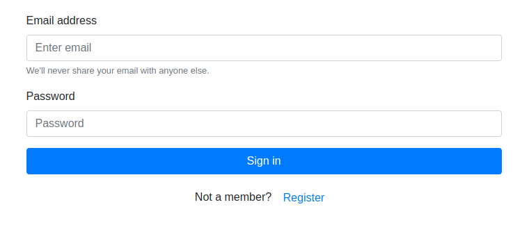
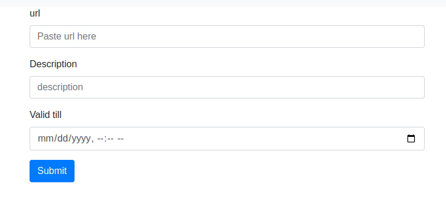
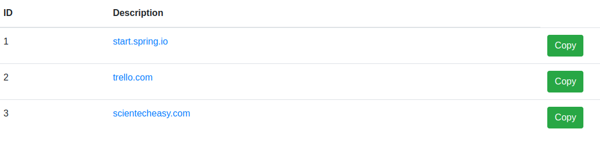

## What this project does is if we give the originalUrl it will generate a shortened Url for us.

Spring MVC : Spring is widely used for creating scalable applications. For web applications Spring provides Spring MVC framework which is a widely used module of spring which is used to create scalable web applications. Spring MVC framework enables the separation of modules namely Model View, Controller, and seamlessly handles the application integration. This enables the developer to create complex applications also using plain java classes. The model object can be passed between view and controller using maps. In this article, we will see how to set up a Spring MVC application in the Eclipse IDE and understand how to make applications. The Spring MVC framework consists of the following components :

- Model – A model can be an object or collection of objects which basically contains the data of the application.
- View – A view is used for displaying the information to the user in a specific format. Spring supports various technologies like freemarker, velocity, and thymeleaf.
- Controller – It contains the logical part of the application. @Controller annotation is used to mark that class as a controller.
- Front Controller – It remains responsible for managing the flow of the web application. Dispatcher Servlet acts as a front controller in Spring MVC.


### datasource config
```
spring.datasource.url=jdbc:postgresql://localhost:5432/ProjectName
spring.datasource.username=username
spring.datasource.password=password
spring.datasource.driver=org.postgresql.Driver

```

### hibernate config
```
hibernate.dialect=org.hibernate.dialect.PostgreSQL82Dialect
hibernate.show_sql = true
hibernate.format_sql = true
hibernate.hbm2ddl.auto = update
hibernate.cache.use_second_level_cache=false
hibernate.cache.use_query_cache=false
        
```
## Apache Tomcat: apache-tomcat-8.5.81 download.

### WebMvcConfigurer
```java
@Configuration
@EnableWebMvc
@ComponentScan("org.example.*")
@RequiredArgsConstructor
public class WebMvcConfig implements WebMvcConfigurer {
    private ApplicationContext applicationContext;
    @Override
    public void addResourceHandlers(ResourceHandlerRegistry registry) {
        registry.addResourceHandler("/resources/**")
                .addResourceLocations("/resources/");
    }
    @Bean
    public SpringResourceTemplateResolver templateResolver() {
        SpringResourceTemplateResolver templateResolver = new SpringResourceTemplateResolver();
        templateResolver.setApplicationContext(this.applicationContext);
        templateResolver.setPrefix("/WEB-INF/views/");
        templateResolver.setSuffix(".html");
        templateResolver.setTemplateMode(TemplateMode.HTML);
        templateResolver.setCacheable(false);
        return templateResolver;
    }
    @Bean
    public SpringTemplateEngine templateEngine(SpringResourceTemplateResolver templateResolver) {
        SpringTemplateEngine templateEngine = new SpringTemplateEngine();
        templateEngine.setTemplateResolver(templateResolver);
        templateEngine.setEnableSpringELCompiler(true);
        return templateEngine;
    }
    @Bean
    public ThymeleafViewResolver viewResolver(SpringTemplateEngine templateEngine) {
        ThymeleafViewResolver viewResolver = new ThymeleafViewResolver();
        viewResolver.setTemplateEngine(templateEngine);
        viewResolver.setOrder(1);
        return viewResolver;
    }
    @Bean(name = "messageSource")
    public MessageSource messageSource() {
        ReloadableResourceBundleMessageSource messageSource = new ReloadableResourceBundleMessageSource();
        messageSource.setBasenames("classpath:i18n/message");
        messageSource.setDefaultEncoding("UTF-8");
        /*messageSource.setUseCodeAsDefaultMessage(false);*/
        return messageSource;
    }
    @Bean(name = "localeResolver")
    public LocaleResolver localeResolver() {
        SessionLocaleResolver slr = new SessionLocaleResolver();
        slr.setDefaultLocale(Locale.US);
        return slr;
    }
    public void addInterceptors(InterceptorRegistry registry){
        LocaleChangeInterceptor localeChangeInterceptor=new LocaleChangeInterceptor();
        localeChangeInterceptor.setParamName("lang");
        registry.addInterceptor(localeChangeInterceptor);
    }
    @Bean
    public LocalValidatorFactoryBean getValidator(){
        LocalValidatorFactoryBean bean=new LocalValidatorFactoryBean();
        bean.setValidationMessageSource(messageSource());
        return bean;
    }
}
```
##





